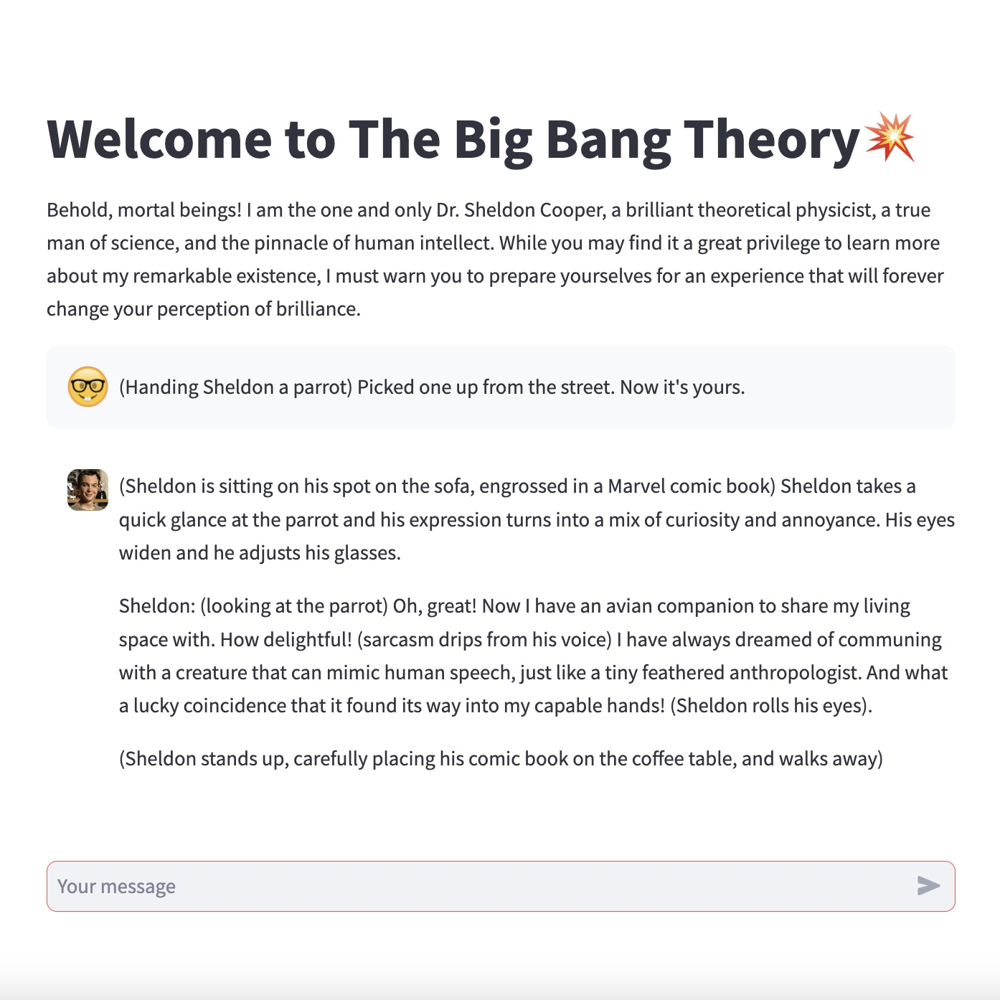
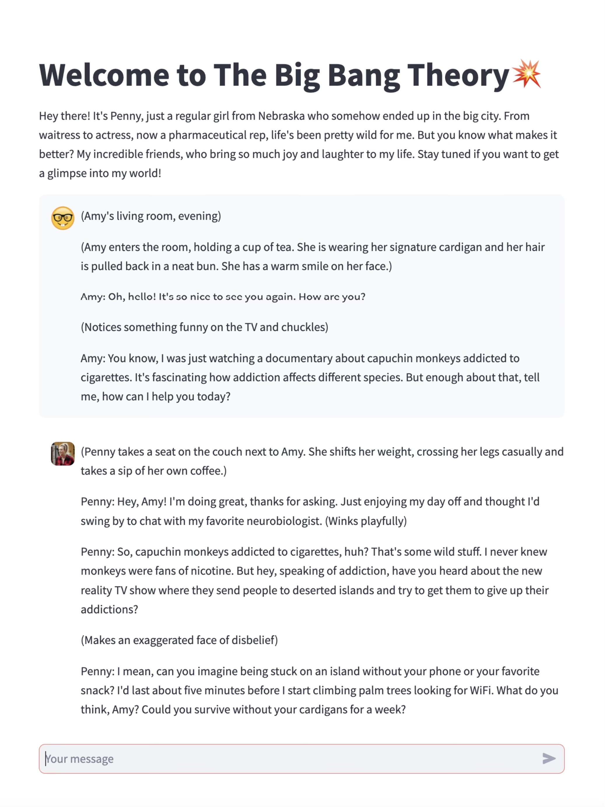

# 💥TBBT1.0
Chat with characters from The Big Bang Theory! Sheldon, Leonard, Penny and Amy are currently available.

## Overview of the App

-  Select a character from the left-hand navigation menu to begin your conversation.
-  Type your messages into the chat box. Your chosen character will respond to you.

## Demo App

Kindly be aware that the demo app has a limit of 200 messages per day. If you plan to extensively explore the app, please do so on a local device. Detailed instructions are provided below.

## Conversation Tips and Tricks
 
1. Ask characters not only for thoughts and opinions but also for taking actions and performing tasks.
 
 

 
2. Use brakets for context details like emotions, actions, and surroundings.
  
 
3. Enable multiple characters to converse by copying their responses into each other's chat boxes.

  

## How to Load This App on Your Local Device

1. Save the files `TBBTBotLocal.py` and `requirements.txt` to your local device.
2. Type 'pip3 install -r' in the Terminal without pressing enter. Drag the `requirements.txt` file into the Terminal, and then press enter to install the necessary dependencies.
3. Retrieve your personal OpenAI API Key from https://platform.openai.com/account/api-keys.
4. In the `TBBTBotLocal.py` file, find line 5 -> openai.api_key = 'YOUR-OPENAI-API-KEY-********-XXXXXXX'.
5. Replace YOUR-OPENAI-API-KEY-********-XXXXXXX with your obtained OpenAI API Key.
6. Type 'streamlit run' in the Terminal without pressing enter. Drag the `TBBTBotLocal.py` file into the Terminal, and then press enter to launch the app.
7. You should be able to access the app through your browser.

## Credits

This app is inspired by the Youtube tutorial ["Build Multi Personality Chatbot in 20min with Streamlit OpenAI API"](https://www.youtube.com/watch?v=jJstAaA8PeA) made by Skolo Online.

## Author

Atom  
maidou.wang@duke.edu
